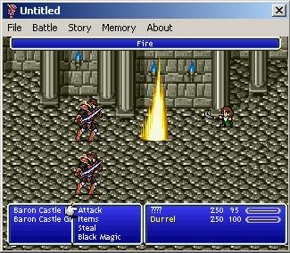



## Lengine \(Complete RPG Engine\)

### Description

Allows you to recreate your own final fantasy games, with battle engine states, side scrolling story, programable AI, user definable stat changing equipment and items, user definable fiends, user definable special abilities for each character. and SFX.

I am a huge final fantasy fan, i just want to give people the chance to make their own final fantasy games. I have been working on this for about a year now, and then i reliesed it wasnt going to get anywhere. I was planning to add status affects, and more stuff, though im not so sure now.

You can track LEngine from this URL:

http://www.neowin.net/forum/index.php?showtopic=509526
 
### More Info
 
Story Script (Custom)

SFX Script (VBScript + Custom Lib)

AI Script (VBScript + Custom Lib)

Configuration INI Files.

Assumes basic script knowledge (VBScript)

A complete 2D RPG Game.

Uses GDI. I am in the process of phasing this project out and making a directdraw version.

             |
---                |---
**Submitted On**   |2006-11-19 10:46:02
**By**             |[Lee Chantrey](https://github.com/Planet-Source-Code/PSCIndex/blob/master/ByAuthor/lee-chantrey.md)
**Level**          |Advanced
**User Rating**    |5.0 (15 globes from 3 users)
**Compatibility**  |VB 6\.0
**Category**       |[Games](https://github.com/Planet-Source-Code/PSCIndex/blob/master/ByCategory/games__1-38.md)
**World**          |[Visual Basic](https://github.com/Planet-Source-Code/PSCIndex/blob/master/ByWorld/visual-basic.md)
**Archive File**   |[Lengine\_\(C20326511232006\.zip](https://github.com/Planet-Source-Code/lee-chantrey-lengine-complete-rpg-engine__1-67124/archive/master.zip)

